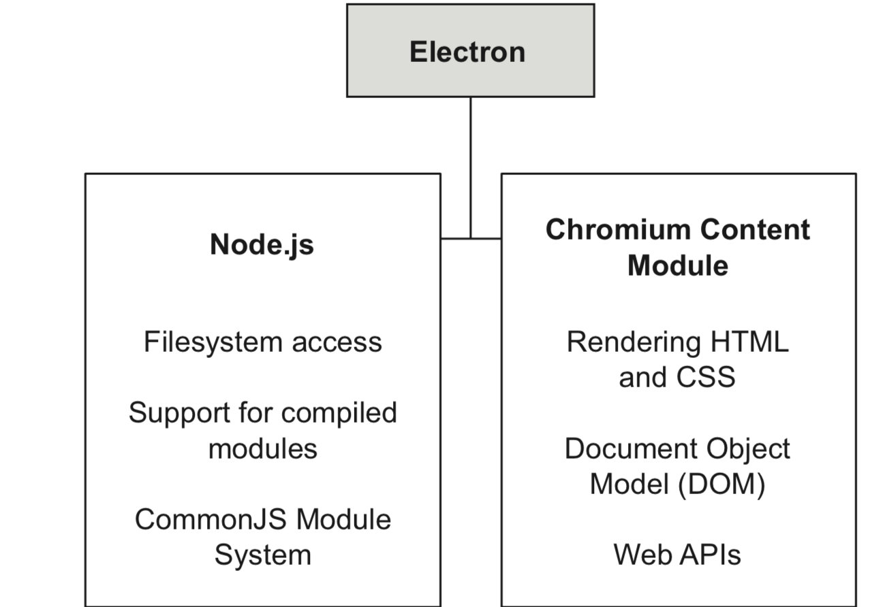
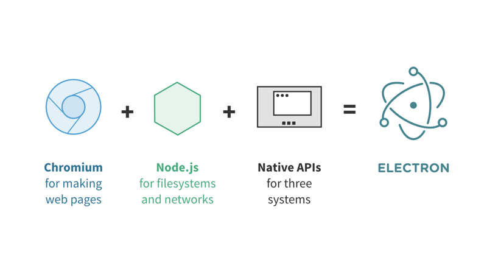
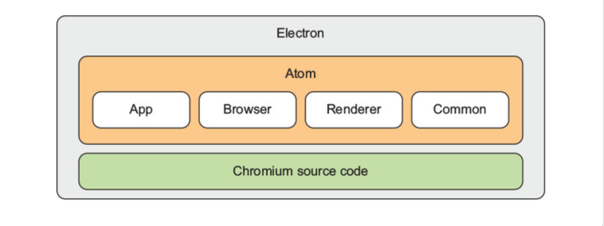
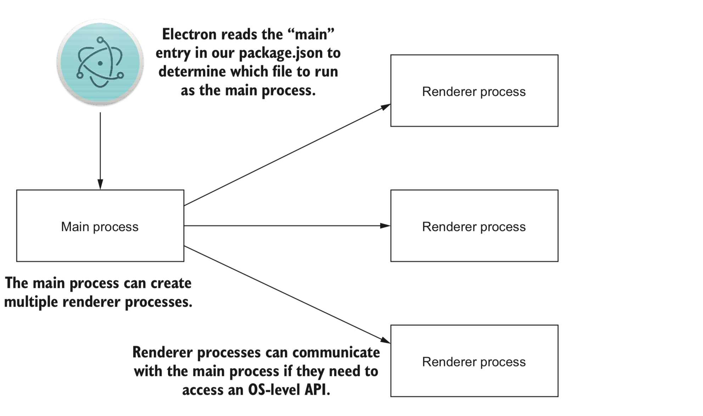

# Electron 快速入门

## What's Electron

**[Electron](https://electronjs.org/) is a runtime(framework) that allows you to build cross platform desktop applications with HTML5, CSS, and JavaScript.**

**Electron combines the Chromium(克洛米恩) Content Module and Node.js runtimes**





**Chromium**: Chromium内容模块只包含呈现HTML、CSS和JavaScript所需的核心技术。

**Native APIS**: 为了提供原生系统的GUI支持，Electron内置了原生应用程序接口，对调用一些系统功能，如调用系统通知、打开系统文件夹提供支持

## Electron components



**App**:  OS先关的c++, objective-c 文件， 加载nodejs, chromium，启动electron等

**Browser**: 主要负责初始化js引擎，前端渲染，UI交互， OS 模块bindings

**Renderer：** 主要渲染进程相关功能

**Common**:  公用代码， 以及node event loop 和 chromium event loop 集成的代码(通过一个单独的线程来获取文件句柄来检测node event(run in main process), 然后发送到Chromium's message loop)

**Chormium source code**:   `Chromium + Node.js`.

**Node Event Loop** :  `libuv event loop`

## How does Electron work?

[**Electron applications consist of two types of processes: the main process and zero or more renderer processes.**](https://electronjs.org/docs/tutorial/application-architecture#main-and-renderer-processes)



### Main Process

**Electron 运行package.json的 main 脚本的进程被称为主进程。一个 Electron 应用总是有且只有一个主进程。**

职责:

- 创建渲染进程（可多个）

- 控制了应用生命周期（启动、退出APP以及对APP做一些事件监听）

- 调用系统底层功能、调用原生资源

可调用的API:

- Node.js API

- Electron提供的主进程API（包括一些系统功能和Electron附加功能）

### 渲染进程

由于 Electron 使用了 Chromium 来展示 web 页面，所以 Chromium 的多进程架构也被使用到。 每个Electron 中的 web页面运行在它自己的渲染进程中。

主进程使用 BrowserWindow 实例创建页面。 每个 BrowserWindow 实例都在自己的渲染进程里运行页面。 当一个 BrowserWindow 实例被销毁后，相应的渲染进程也会被终止。

你可以把渲染进程想像成一个浏览器窗口，它能存在多个并且相互独立，不过和浏览器不同的是，它能调用Node API。

职责：

- 加载HTML和CSS渲染界面
- 用JavaScript做一些界面交互

可调用的API:

- DOM API
- Web API
- Node.js API(**存在安全隐患**)
- Electron提供的渲染进程API

### 其他参考链接
[electron-internals-node-integration](https://electronjs.org/blog/electron-internals-node-integration#polling-nodes-event-loop-in-a-separate-thread)

[Exploring NW.js and Electron’s internals](https://livebook.manning.com/book/cross-platform-desktop-applications/chapter-6/)

## IPC(interprocess communication) 进程间通信


[ipcMain](https://electronjs.org/docs/api/ipc-main#ipcmain): The `ipcMain` module is an [Event Emitter](https://nodejs.org/api/events.html#events_class_eventemitter). When used in the main process, it handles asynchronous and synchronous messages sent from a renderer process (web page). Messages sent from a renderer will be emitted to this module.

[ipcRenderer](https://electronjs.org/docs/api/ipc-renderer): The `ipcRenderer` module is an [EventEmitter](https://nodejs.org/api/events.html#events_class_eventemitter). It provides a few methods so you can send synchronous and asynchronous messages from the render process (web page) to the main process. You can also receive replies from the main process.

**示例**

```javascript
// renderer process
const {ipcRenderer} = require('electron')

const asyncMsgBtn = document.getElementById('async-msg')

asyncMsgBtn.addEventListener('click', () => {
  ipcRenderer.send('asynchronous-message', 'ping')
})

ipcRenderer.on('asynchronous-reply', (event, arg) => {
  const message = `Asynchronous message reply: ${arg}`
  document.getElementById('async-reply').innerHTML = message
})
```

```javascript
// Main process
const {ipcMain} = require('electron')

ipcMain.on('asynchronous-message', (event, arg) => {
  event.sender.send('asynchronous-reply', 'pong')
})
```

**当关闭nodeIntegration时上面的代码将不可用**， 可以通过以下代码实现：

*nodeIntegration*: 可以防止跨站脚本攻击， 防止xxs升级为"Remote Code Execution" (RCE) attack等

```javascript
// preload.js
const electron = require('electron');

process.once('loaded', () => {
  window.ipcRenderer = electron.ipcRenderer
})

// main.js
const {app, BrowserWindow, ipcMain} = require('electron');

app.on('ready', () => {
  // Create the browser window.
  win = new BrowserWindow({
      backgroundColor: '#fff', // always set a bg color to enable font antialiasing
      webPreferences: {
        preload: path.join(__dirname, './preload.js'), // 加载preload文件
        nodeIntegration: false,
        enableRemoteModule: false,
      }
  });
  
ipcMain.on('asynchronous-message', (event, arg) => {
  event.sender.send('asynchronous-reply', 'pong')
})
...

// renderer.js
const asyncMsgBtn = document.getElementById('async-msg')

asyncMsgBtn.addEventListener('click', () => {
  window.ipcRenderer.send('asynchronous-message', 'ping')
})

ipcRenderer.on('asynchronous-reply', (event, arg) => {
  const message = `Asynchronous message reply: ${arg}`
  document.getElementById('async-reply').innerHTML = message
})
```

**以下方式也是可以的：**

```javascript
// preload.js
const { ipcRenderer } = require('electron');

process.once('loaded', () => {
  window.addEventListener('message', event => {
    // do something with custom event
    const message = event.data;

    if (message.myTypeField === 'my-custom-message') {
      ipcRenderer.send('custom-message', message);
    }
  });
});

// renderer.js
window.postMessage({
  myTypeField: 'my-custom-message',
  someData: 123,
});
```

## 安全最佳实践

- 使用最新稳定版本的eletron
- 审查项目依赖，因为有的依赖可以回有漏洞
- 隔离不被信任的内容， 永远不要相信用户的输入
- 更多安全信息请查看[Electron 文档 - 安全建议](https://electronjs.org/docs/tutorial/security#清单：安全建议)

## 入门实例

- [first-app-tutorial](https://electronjs.org/docs/tutorial/first-app)

  ```shell
  # try this example
  
  # Clone the repository
  $ git clone https://github.com/electron/electron-quick-start
  # Go into the repository
  $ cd electron-quick-start
  # Install dependencies
  $ npm install
  # Run the app
  $ npm start
  ```

- [electron basic](http://jlord.us/essential-electron/)

- [electron-api-demos](https://github.com/electron/electron-api-demos)(**我觉得这个很不错**)

  ```javascript
  git clone https://github.com/electron/electron-api-demos
  cd electron-api-demos
  npm install
  npm start
  ```

- 参考《Electron in action》

## 调试

**方法一：**

- Mac: `Command + Optional + i`, 或者在菜单栏上点击view -> toggle devtools

- Windows: `Control + Shift + i`

**方法二：**

```javascript
  mainWindow.webContents.openDevTools()
  mainWindow.maximize()
  require('devtron').install()
```

**方法三：**

[使用vscode debugger](https://electronjs.org/docs/tutorial/debugging-main-process-vscode)

## 参考链接

- [Electron documentation](https://electronjs.org/docs)
- [Awesome-electron](https://github.com/sindresorhus/awesome-electron)
- [Electron basic](http://jlord.us/essential-electron/)
- [Electron security](https://electronjs.org/docs/tutorial/security)
- [Electron构建跨平台应用](https://www.jianshu.com/p/2244653515a7)
