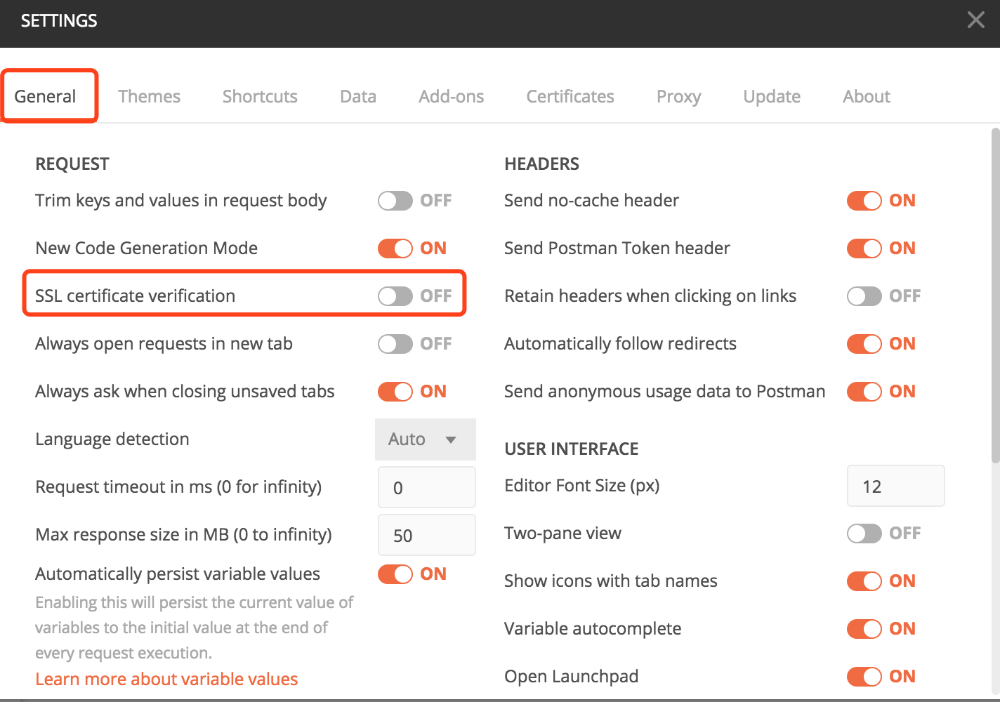
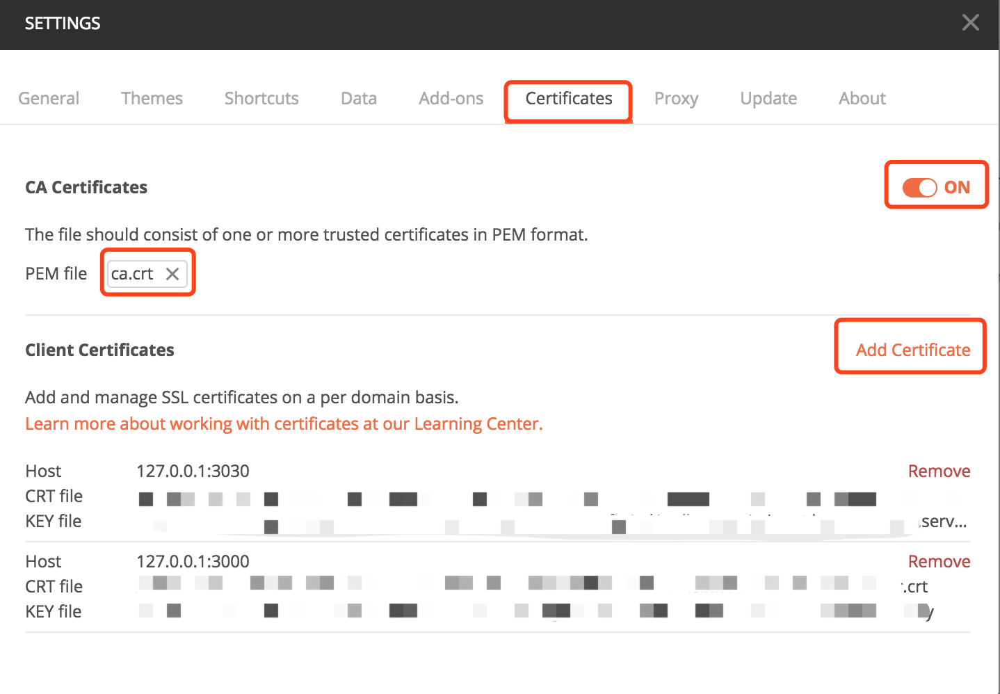

# Postman使用自签名证书发送https请求

做笔记，做笔记， 好记性不如烂笔头。

## 设置步骤

1. `Command + ,` 打开Settings 面板 或点击右上角的**小扳手图标**， 如下图：

   

2. 在**General**面板中关闭**SSL certificate verification**， 如下图：
   
   

3. 切换**Certificates**面板

4. 开启**CA Certificates**， 选择ca.cert文件

5. 点击**Add  Certificates** 按钮

6. 根据提示填写URL地址和端口， 选择对应的cert、key文件
   
   

